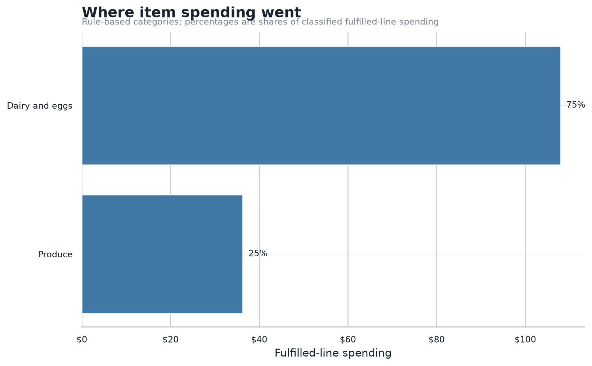

# Grocery Spend Lab

**Analyze your grocery purchase history locally.**

Grocery Spend Lab turns itemized receipts into spending charts and inspectable
tables. It includes a visible-browser exporter for Harris Teeter and an offline
Python analyzer for the documented [JSON input format](docs/input-schema.md).

[Try the synthetic example](#try-the-synthetic-example) ·
[Export Harris Teeter history](#export-harris-teeter-history) ·
[Use it with an agent](#agent-use)



*Example output generated from the repository's synthetic receipts.*

## What it shows

- Spending by category and month.
- Delivery fees, tips, and basket patterns.
- Retailer-recorded markdown incidence.
- Exact-UPC observations for repeatedly purchased products.
- Brand, product-attribute, and milk/egg purchase patterns.
- Reconciliation exceptions and the tables behind every chart.

Reports cover the retailer history you supply, not all household grocery
spending. Categories and attributes use deterministic text rules, and savings
are retailer labels rather than proof of deal quality. Exact-UPC observations
are not a market inflation index.

## Install from source

Install the Python analyzer from a source checkout:

```bash
git clone https://github.com/smwitkowski/grocery-spend-lab.git
cd grocery-spend-lab
python3 -m venv .venv
. .venv/bin/activate
pip install -e .
```

The Python analyzer is prepared for PyPI distribution. After the first release,
it will also run without a permanent install:

```bash
uvx grocery-spend-lab --version
pipx run grocery-spend-lab --version
```

## Try the synthetic example

The included fixtures contain no household data:

```bash
grocery-spend analyze \
  --orders examples/orders.json \
  --items examples/items.json \
  --output outputs/example \
  --merchant "Example Market"
```

The new output directory contains an analysis summary, auditable CSV tables,
eight PNG charts, reconciliation exceptions, and a hashed `manifest.json`.

## Agent use

The repository ships a portable Agent Skill at
[`skills/grocery-spend-lab/SKILL.md`](skills/grocery-spend-lab/SKILL.md). The
CLI has stable JSON discovery, validation, and result contracts:

```bash
grocery-spend capabilities
grocery-spend schema --name command-result
grocery-spend validate --orders examples/orders.json --items examples/items.json
```

Every completed analysis includes `manifest.json` with input hashes, options,
warnings, artifact hashes, and aggregate counts. See the
[agent interface](docs/agent-interface.md) for the complete contract.

## Export Harris Teeter history

The exporter launches a visible Brave or Chromium window with a dedicated
browser profile. Sign in yourself, then leave the purchase-history page open
while the tool indexes and exports receipts. It uses the requests made by the
signed-in webpage; credentials, cookies, and request headers are not included in
the export.

Install its Node dependency from the repository first:

```bash
npm install
```

```bash
npx --no-install grocery-spend-export-harris-teeter \
  --output exports/ht-2026-09-16 \
  --account household-1 \
  --start 2026-01-01
```

Set `BRAVE_PATH` or pass `--browser-path` for another Chromium executable. The
exporter writes normalized JSON and CSV. Provider response bodies are saved for
parser audits only when `--save-raw-responses` is supplied; those files may
contain sensitive account or payment details. Agents should use
`--non-interactive` so a missing login returns immediately with `AUTH_REQUIRED`
instead of waiting.

## Analyze an export

```bash
grocery-spend analyze \
  --orders exports/ht-2026-09-16/orders.json \
  --items exports/ht-2026-09-16/items.json \
  --output outputs/analysis-2026-09-16 \
  --merchant "Harris Teeter" \
  --account-label "household loyalty account" \
  --event-date 2026-07-04 \
  --event-label "Move"
```

The output directory must be new. A completed run writes its manifest last and
never overwrites an earlier analysis.

## Interpretation limits

- Coverage is the supplied retailer export, not total household grocery spending.
- Categories and brand types are deterministic text rules. `Brand unclear`
  stays separate instead of being guessed.
- Savings are labels supplied by the retailer. The tool measures incidence and
  dollars, not deal effectiveness.
- Price charts compare exact UPCs. They describe selected items and do not form
  an inflation index.
- Event windows are descriptive; channel, season, store, household needs, and
  incomplete coverage can explain apparent changes.

## License

MIT
