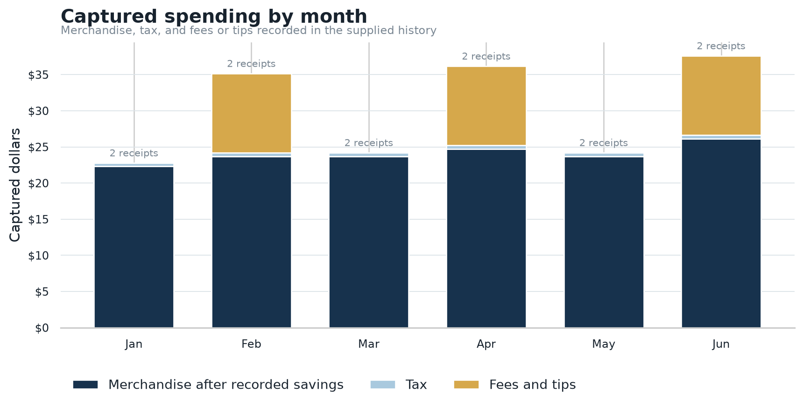
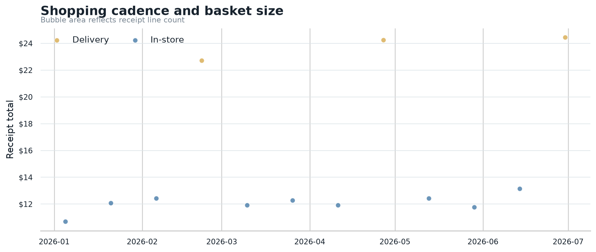
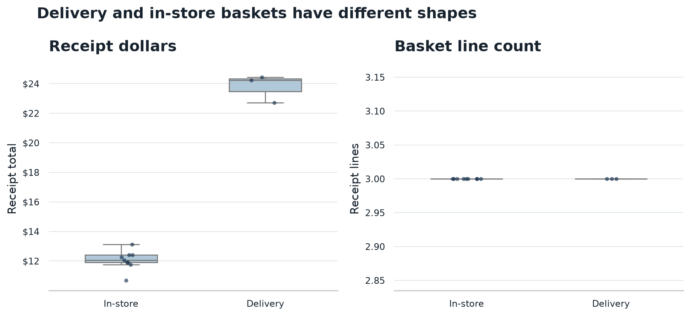
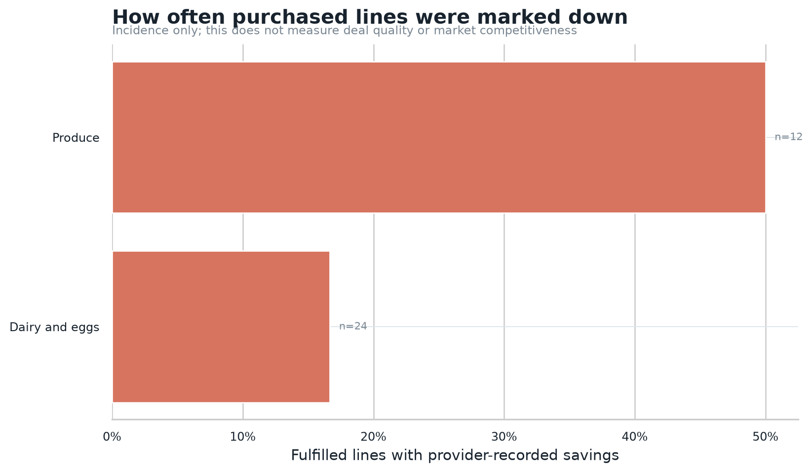
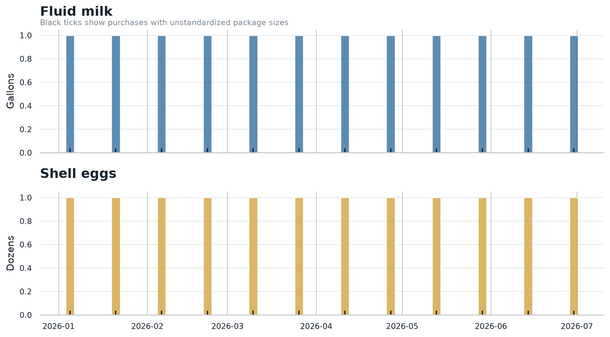
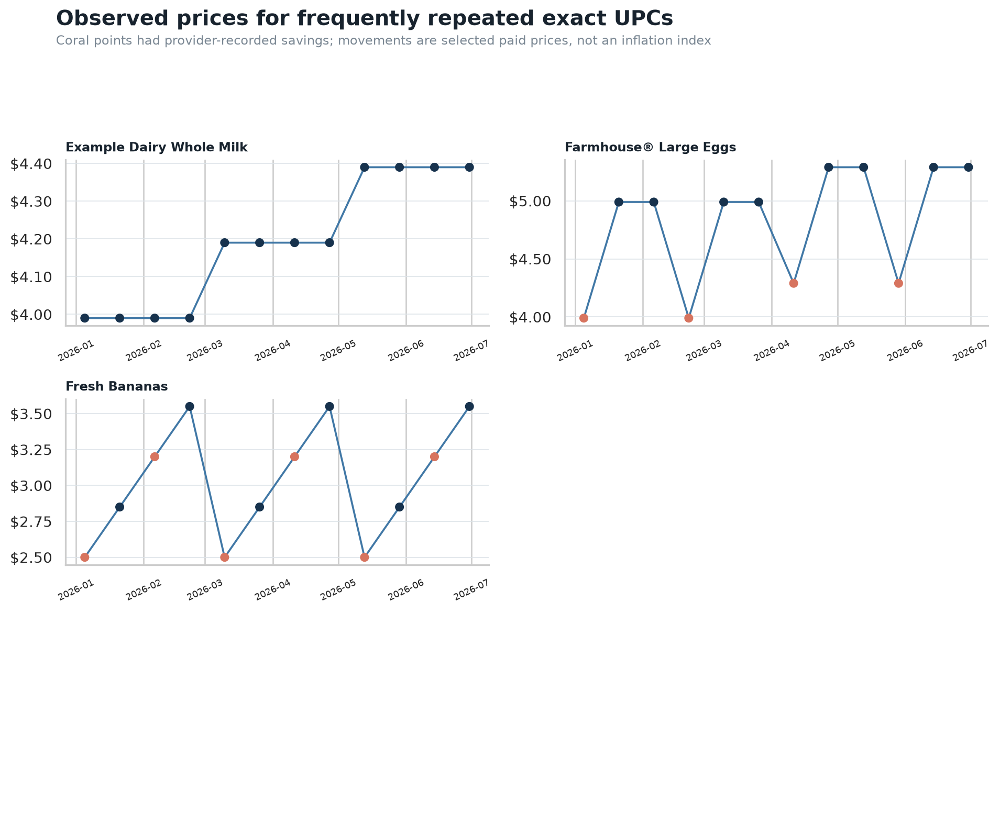

# Synthetic example report

This page arranges selected Grocery Spend Lab artifacts into a readable report.
Every chart was generated by the CLI from the repository's synthetic
[`orders.json`](../examples/orders.json) and
[`items.json`](../examples/items.json). No household data appears here.

| Coverage | Captured total | Fulfilled lines | Channels |
|---|---:|---:|---|
| Jan–Jun 2026 · 12 receipts | $179.98 | 36 | 9 in-store · 3 delivery |

The synthetic run recorded $144.26 of item spending after retailer-recorded
savings, $2.87 of tax, and $32.85 of delivery fees and tips. All receipt and item
totals reconciled within the tool's tolerance.

## Spending composition



The monthly view separates merchandise, tax, and convenience costs. It describes
only the receipts present in the input; a shorter bar can also mean incomplete
coverage.


Categories are deterministic text classifications. In this deliberately small
fixture, dairy and eggs account for 75% of fulfilled-line spending and produce
accounts for 25%.

## Channel and shopping cadence



The timeline shows when purchases occurred, their totals, and their channel.
Bubble area represents receipt line count.



The channel comparison keeps receipt dollars and basket line counts separate.
The three synthetic delivery orders include $32.85 in fees and tips, or $10.95
per delivery order.

## Retailer-recorded markdowns and staples



Markdown incidence reports the retailer's labels. It does not establish deal
quality or compare prices with another store.



The staple view standardizes recognized package sizes where possible and keeps
unstandardized purchases visible instead of guessing their quantities.

## Repeat-product prices



Price observations compare exact UPCs with at least three purchase dates across
60 days. Coral points had retailer-recorded savings. These selected products do
not form a household or market inflation index.

## Audit trail

A completed analysis also contains:

- `analysis_summary.json` with scope, totals, coverage, and methodology.
- Twelve derived CSV tables, including channel, category, staple, price, and
  reconciliation data.
- `manifest.json` with input hashes, options, warnings, aggregate counts, and a
  hash for every artifact. The manifest is written last.

Reproduce this example from the repository root:

```bash
grocery-spend analyze \
  --orders examples/orders.json \
  --items examples/items.json \
  --output outputs/example \
  --merchant "Example Market" \
  --account-label "synthetic example"
```

The output directory must not already exist. See the
[input schema](input-schema.md) and [agent interface](agent-interface.md) for the
machine-readable contracts.
